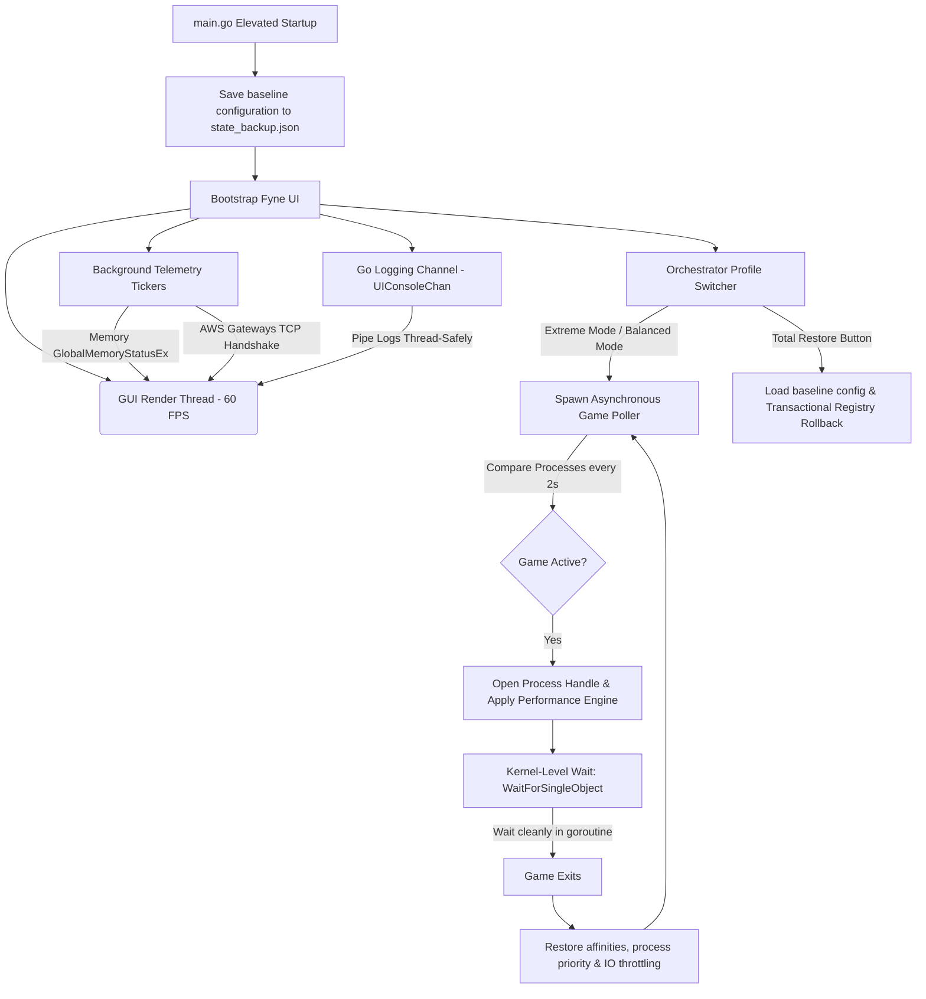

# 🚀 NosBoost Optimizer — Production-Grade Windows Performance Suite

[](https://golang.org)
[](https://microsoft.com/windows)
[](https://fyne.io)
[](https://github.com/akavel/rsrc)
[](#)

**NosBoost Optimizer** is an ultra-high-performance, low-level system tuning, network latency reduction, and hardware optimization suite designed exclusively for competitive Windows eSports players. Written entirely in **pure Go (Golang)**, it completely bypasses heavy web wrappers (Electron, Wails, WebView) to interact directly with the operating system kernel via native Win32 APIs, native PowerShell bindings, and undocumented Windows NT system interfaces.

---

## 📌 Core Engineering & Design Principles

1. **Zero-Web Wrapper Footprint**: NosBoost runs on the hardware-accelerated **Fyne (v2)** graphics engine (OpenGL core), compiling into a single, compact, standalone binary. Idle memory usage is ultra-low, with absolutely zero background tracking nodes or Chromium processes.
2. **100% Anti-Cheat Compliant**: NosBoost does **not** hook game processes, inject DLLs, read/write virtual memory, or modify game files. It optimizes global OS layers, network adapters, and thread scheduling policies. It is fully compliant with **Easy Anti-Cheat, BattlEye, Riot Vanguard, FaceIt, and Valve Anti-Cheat (VAC)**.
3. **Zero-Failure Safety Guarantee**: At first startup, NosBoost captures a pristine, transactional snapshot of every modified registry hive, power scheme, and system service into `state_backup.json`. The **Total Rollback** feature guarantees a 100% reversible, clean system restore back to your default OS baseline.
4. **Dynamic i18n & Refined Layout**: Fully localized in English and Turkish with dynamic runtime switching and self-correcting grid layouts that eliminate text clipping across different monitor DPI settings.

---

## ⚡ Key Optimizations & Architectural Modules

NosBoost is organized into core domain-specific performance layers:

### 🎮 1. CPU Core Locking & Esports Thread Scheduling
* **Dynamic Core Unparking**: Programmatically sets Windows CPU Core Parking thresholds (`CPMinCores` & `CPMaxCores`) to `100%` on the active power scheme, keeping all physical/logical processor cores awake and eliminating scheduling spin-locks.
* **Win32 Priority Separation**: Modifies `Win32PrioritySeparation` to `0x26` (Short, Variable Quantum Ratios with high foreground boost), allocating maximum CPU clock cycle weight to active games rather than background tasks.
* **Windows MMCSS (Multimedia Class Scheduler Service) Games Task**:
  * Injects competitive priorities under the `SOFTWARE\Microsoft\Windows NT\CurrentVersion\Multimedia\SystemProfile\Tasks\Games` hive:
    * `Priority = 6` (High Scheduling Priority), `GPU Priority = 8` (High GPU Priority)
    * `Scheduling Category = "High"`, `SFIO Priority = "High"` (Starvation-Free I/O scheduler override)
    * `Background Only = "False"` (Forbids the OS from throttling the game thread in the background)
* **Hybrid Asynchronous Poller**:
  * Sweeps active processes on a 2-second heartbeat without dynamic polling tax.
  * Captures the running game's handle to isolate affinity: assigns background threads and browsers strictly to Cores 0-1, yielding Cores 2-N exclusively to the game.
  * Utilizes kernel-level blocking `WaitForSingleObject` in a thread-safe goroutine to detect game closure and seamlessly restore default priority states.

### 🌐 2. Esports Low-Latency Network Stack
* **Nagling & Packet Delay Elimination**: Disables delayed TCP ACK timers by setting `TcpAckFrequency = 1` and `TCPNoDelay = 1` across all active network card GUID parameter hives, reducing packet delivery latency.
* **TCP Delayed ACK Overrides**: Sets `TcpDelAckTicks = 0` to trigger instantaneous responses without buffering delays, reducing competitive game ping spikes.
* **Network Adapter Power/Jitter Shield**:
  * Disables **Packet Coalescing** via PowerShell bindings (`Disable-NetAdapterPacketCoalescing -Name *`), avoiding packet batching delays.
  * Disables adapter power-saving configurations (`*FlowControl = 0`, `*InterruptModeration = 0`) across device Class GUIDs to eliminate wake-up latency and interrupt delays on high-performance NICs.
  * Disables network auto-tuning heuristics (`netsh int tcp set global heuristics=disabled`) to prevent bandwidth/buffer throttling on competitive networks.
* **Esports Subnet Routing**: Automatically parses regional game server IP subnets to inject custom static physical routing table overrides (`route add`), bypassing bloated routing hops for esports server endpoints.

### 🧠 3. Physical RAM Compaction & Kernel Paging Lock
* **Direct Working Set Flushing**: Sweeps inactive memory pools (`EmptyWorkingSet` via Win32 `psapi.dll`) of non-critical system applications, transferring idle physical RAM to active game buffers.
* **Windows NT Cache Purification**: Invokes undocumented Windows NT system info overrides (`NtSetSystemInformation` Class 80) to purge OS standby and modified memory list queues.
* **Paging Executive Optimizer (Lock Kernel/Drivers in RAM)**:
  * Overrides `DisablePagingExecutive = 1` inside `SYSTEM\CurrentControlSet\Control\Session Manager\Memory Management`.
  * Prevents Windows from swapping kernel data, driver routines, and system libraries onto disk, eliminating micro-stutters (improving 95% and 99% frame rate lows) during high-action gaming.

### ⚙️ 4. Hardware Interrupts & Mouse/Keyboard Queues
* **MSI (Message Signaled Interrupts) Mode**: Traverses the system PCI Express registry tree, converting compatible Graphics Adapters (GPUs) and High-Performance Network Interface Cards (NICs) to high-priority MSI mode, reducing hardware interrupt overlap stutters.
* **Peripheral Reporting Buffers**: Standardizes input buffers (`mouclass` and `kbdclass` queues) down to 20 to suppress buffer processing stutters, accelerating competitive crosshair response.

---

## 🖥️ Multi-Threaded GUI Architecture

The application relies on a multi-threaded asynchronous Go structure to isolate the UI thread from hardware interactions:



---

## 📦 Production Compilation & Build Manifesto

Because NosBoost Optimizer accesses protected registry keys, modifies active hardware settings, and stops/starts Windows services, the binary **requires administrative privileges** (`requireAdministrator`). 

### 1. GCC Toolchain Prerequisite
Compiling Fyne requires CGO support. A valid C compiler (such as GCC) must be available in your system path:
* **Option A: MSYS2**
  1. Install [MSYS2](https://www.msys2.org/).
  2. Run the following command in the MSYS2 terminal:
     ```bash
     pacman -S mingw-w64-x86_64-toolchain
     ```
  3. Add `C:\msys64\mingw64\bin` to your Windows Environment `PATH`.
* **Option B: Chocolatey**
  ```powershell
  choco install mingw
  ```

Verify the compiler is active in your terminal:
```powershell
gcc --version
```

### 2. Automated Resource Compilation (Icon + Manifest)
We have automated the native resource bundling process.
* **`nosboost.manifest`**: Configures application visual styling (Common Controls v6) and enforces administrative escalation (`requireAdministrator`).
* **`assets/icon.ico`**: A high-fidelity multi-resolution icon (`16x16` to `256x256` px) compiled via .NET System.Drawing.

To compile these assets into an native Windows COFF resource file (`cmd/nosboost/rsrc.syso`):
```powershell
go run compile_resources.go
```
This utility automatically installs `rsrc` (if missing), locates your GOPATH, converts files, and links them perfectly.

### 3. Compilation of the Final Binary
To compile the highly optimized, portable, statically-linked production binary, run the following build command:
```powershell
# Set CGO environment flag active
$env:CGO_ENABLED="1"

# Build with optimized flags
go build -ldflags="-s -w -H=windowsgui -extldflags '-static'" -o NosBoostOptimizer.exe ./cmd/nosboost
```

#### Linker Flags Decoded:
* `-s -w`: Strips all debug symbol tables, reducing binary size from ~55MB down to ~27MB.
* `-H=windowsgui`: Fully hides the legacy command prompt console window, running as a native Windows graphical application.
* `-extldflags "-static"`: Forces the external compiler to link standard runtime libraries statically, preventing "missing dll" crashes on machines lacking GCC/MinGW dependencies.

---

## 🏷️ GitHub Releases & Dynamic Build Versioning

When publishing updates on GitHub, you can override the application build version dynamically at compilation time without modifying code files.

Set the target release tag using Go compiler `-ldflags`:
```powershell
$env:CGO_ENABLED="1"
go build -ldflags="-s -w -H=windowsgui -extldflags '-static' -X 'nosboost/internal/config.AppVersion=v1.2.0'" -o NosBoostOptimizer.exe ./cmd/nosboost
```

This dynamically binds `v1.2.0` (or any custom tag) into the application's runtime metadata. The localized UI sub-headers and telemetry panels instantly render the new tag in both English and Turkish.

---

## 🧪 Unit Testing

NosBoost features fully passing mock-resilient unit tests. Run unit tests safely in standard (non-elevated) shells. Target registry routines will log graceful warnings and skip live registry manipulations:

```powershell
go test -v ./...
```
