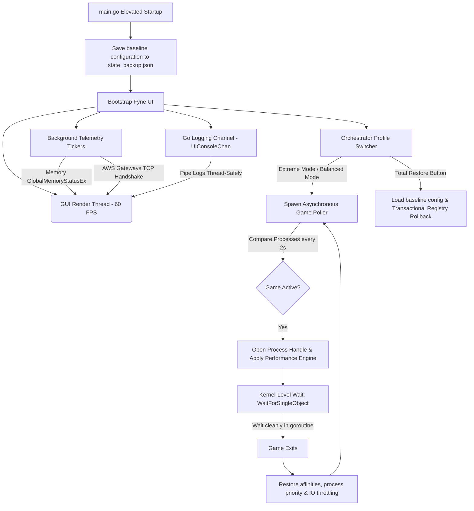

# 🚀 NosBoost Optimization Engine

NosBoost is an ultra-high-performance, low-level System, Network, Hardware, and Gaming Optimization Suite written entirely in Go (Golang) for Windows (x64). It delivers premium gaming performance by bypassing bloated web wrappers and running raw system manipulations through native Win32 and undocumented Windows NT APIs.

---

## 📌 Core Design Principles

1.  **Zero Electron / Webview / Wails**: NosBoost compiles into a single, lightweight, standalone native Windows binary powered by the hardware-accelerated **Fyne (v2)** graphics engine. It has a micro-footprint and utilizes zero background web services.
2.  **Zero AI Inside**: Deterministic, high-efficiency systems engineering. It relies entirely on official OS layers, hardware interface tweaks, and network routing configurations.
3.  **100% Anti-Cheat Compliant**: Safely operates alongside kernel-level anti-cheats (Easy Anti-Cheat, BattlEye, Vanguard, FaceIt). NosBoost **does not** inject memory, hook handles, or modify game binaries; it only optimizes official Windows parameters.
4.  **Zero-Failure Safety Policy**: Captures a full OS transaction backup (`state_backup.json`) at startup. A one-click **Total Restore** rolls back all parameters to their original baseline state.

---

## ⚡ Key Optimizations & Modules

*   **CPU & Core Parking**: Locks active schemes to 100% awake CPU cores (`CPMinCores` & `CPMaxCores`). Sets `Win32PrioritySeparation` to `0x26` (short-variable foreground quantum ratios) to allocate maximum clock cycles to active games.
*   **Asynchronous Hybrid Poller**: Sweeps system processes every 2 seconds. Upon game launch, it acquires a synchronized process handle and invokes the Win32 kernel-level `WaitForSingleObject` blocking call. This isolates game thread affinities to Cores 2-N (binding background applications to Core 0/1) and elevates game priority to High with **zero CPU polling overhead**.
*   **RAM & SysMain Compaction**: Sweeps non-critical process working sets (`EmptyWorkingSet` via `psapi.dll`) and purges system standby and modified memory lists via undocumented NT calls (`NtSetSystemInformation` Class 80). Disables the SysMain service during gaming to eliminate indexer stutters.
*   **TCP NoDelay & Esports Routing**: Disables packet buffering (Nagle's Algorithm) by injecting `TCPNoDelay` & `TcpAckFrequency` = 1 under active network card parameters. Translates subnet CIDRs to physical routing tables, injecting custom static bypasses for competitive regional esports servers.
*   **Hardware MSI Modes & Peripheral Buffers**: Traverses active PCI Display (GPU) and NIC adapters using a three-factor safety active check, converting devices to Message Signaled Interrupts (MSI) with High priority. Downsizes mouse and keyboard reporting queues (`mouclass` & `kbdclass`) to 20 to eliminate input stutters.
*   **BCDEDIT Timer Alignment**: Disables high-latency legacy platform clocks (`useplatformclock No`) and freezes dynamic tick generators (`disabledynamictick Yes`), aligning kernel clocks perfectly to hardware TSC.
*   **Disk Priority & Garbage Collector**: Sweeps temporary system folders (%TEMP%, Prefetch, CrashDumps) recursively, gracefully bypassing locks. Throttles background noise applications (browsers, updaters, launchers) to low disk I/O priority (`ProcessIoPriority` Class 33) to yield NVMe channels exclusively to the game.

---

## 🖥️ Multi-Threaded GUI Architecture



---

## 🛠️ Compilation & Standalone Build Manifesto

Because NosBoost manipulates registry hives, starts/stops Windows services, and injects network routing entries, the compiled standalone binary **must run with administrative privileges** (`requireAdministrator`). 

Furthermore, compiling the **Fyne (v2)** graphics engine requires **CGO** enabled, which depends on a **GCC compiler** (such as MinGW-w64) in the Windows PATH.

### 1. Prerequisites (GCC Compiler)
Ensure a GCC environment is installed on your Windows machine:
*   **MSYS2 / MinGW**: Install [MSYS2](https://www.msys2.org/) and run:
    ```bash
    pacman -S mingw-w64-x86_64-toolchain
    ```
    Add `C:\msys64\mingw64\bin` to your system environment `PATH`.
*   **Chocolatey**: Alternatively, if you use Chocolatey:
    ```powershell
    choco install mingw
    ```

Verify your GCC compiler is active in PowerShell:
```powershell
gcc --version
```

### 2. Method A: Embedding Admin Privileges using `rsrc` (Recommended)

This method embeds an official XML manifest into the Windows binary. The OS will automatically display the User Account Control (UAC) prompt requesting Administrator elevation upon launching.

1.  **Install `rsrc`**:
    ```powershell
    go install github.com/akavel/rsrc@latest
    ```
2.  **Create the Manifest File**: Create a file named `nosboost.exe.manifest` in your project root:
    ```xml
    <?xml version="1.0" encoding="UTF-8" standalone="yes"?>
    <assembly xmlns="urn:schemas-microsoft-com:asm.v1" manifestVersion="1.0">
      <assemblyIdentity version="1.0.0.0" processorArchitecture="*" name="NosBoost" type="win32"/>
      <description>NosBoost - Low Latency Gaming Optimization Suite</description>
      <trustInfo xmlns="urn:schemas-microsoft-com:asm.v3">
        <security>
          <requestedPrivileges>
            <requestedExecutionLevel level="requireAdministrator" uiAccess="false"/>
          </requestedPrivileges>
        </security>
      </trustInfo>
    </assembly>
    ```
3.  **Compile the Manifest**: Compile the manifest into a `.syso` object file. The Go compiler will automatically link this object file during compile:
    ```powershell
    rsrc -manifest nosboost.exe.manifest -o cmd/nosboost/rsrc.syso
    ```
4.  **Build the Standalone Binary**:
    Compile the binary with CGO enabled. Use static external linker flags (`-extldflags "-static"`) to package MinGW/GCC C runtime libraries inside the binary, enabling 100% portable standalone execution. Suppress standard symbols (`-s -w`) to optimize file size, and hide the console window (`-H=windowsgui`):
    ```powershell
    $env:CGO_ENABLED="1"
    go build -ldflags="-s -w -H=windowsgui -extldflags '-static'" -o NosBoostOptimizer.exe ./cmd/nosboost
    ```

---

### 3. Method B: Embedding Resources using `go-winres` (Modern)

`go-winres` is a modern, Go-native resource compiler that can embed icons, manifests, and version properties.

1.  **Install `go-winres`**:
    ```powershell
    go install github.com/tc-hib/go-winres@latest
    ```
2.  **Initialize winres structure**:
    ```powershell
    go-winres init
    ```
    This generates a `winres/winres.json` file.
3.  **Add Administrator Enforcement**: Edit `winres/winres.json` and ensure the manifest node enforces elevation:
    ```json
    "manifest": {
      "requestedExecutionLevel": "requireAdministrator"
    }
    ```
4.  **Compile Resources**:
    ```powershell
    go-winres make
    ```
5.  **Build Binary**:
    ```powershell
    $env:CGO_ENABLED="1"
    go build -ldflags="-s -w -H=windowsgui -extldflags '-static'" -o NosBoostOptimizer.exe ./cmd/nosboost
    ```

---

## 🏷️ GitHub Releases & Dynamic Versioning

NosBoost supports a dynamic, build-time overridable version control system. The version is managed in a single variable inside `internal/config/version.go`. 

When preparing a production release for GitHub, you can dynamically inject the target tag/release version into the binary at compile time using Go compiler `-ldflags`:

```powershell
$env:CGO_ENABLED="1"
go build -ldflags="-s -w -H=windowsgui -extldflags '-static' -X 'nosboost/internal/config.AppVersion=v1.1.0'" -o NosBoostOptimizer.exe ./cmd/nosboost
```

This dynamically binds `v1.1.0` (or any custom tag) into the application's core metadata, and automatically renders the updated version inside the localized GUI sub-headers in both English and Turkish instantly.

---

## 🧪 Unit Testing

NosBoost features fully passing mock-resilient unit tests. Run unit tests safely in standard (non-elevated) shells. Target registry routines will log graceful warnings and skip live registry manipulations:

```powershell
go test -v ./internal/booster ./internal/cleaner ./internal/config ./internal/hardware ./internal/memory ./internal/network ./internal/syswatch
```
